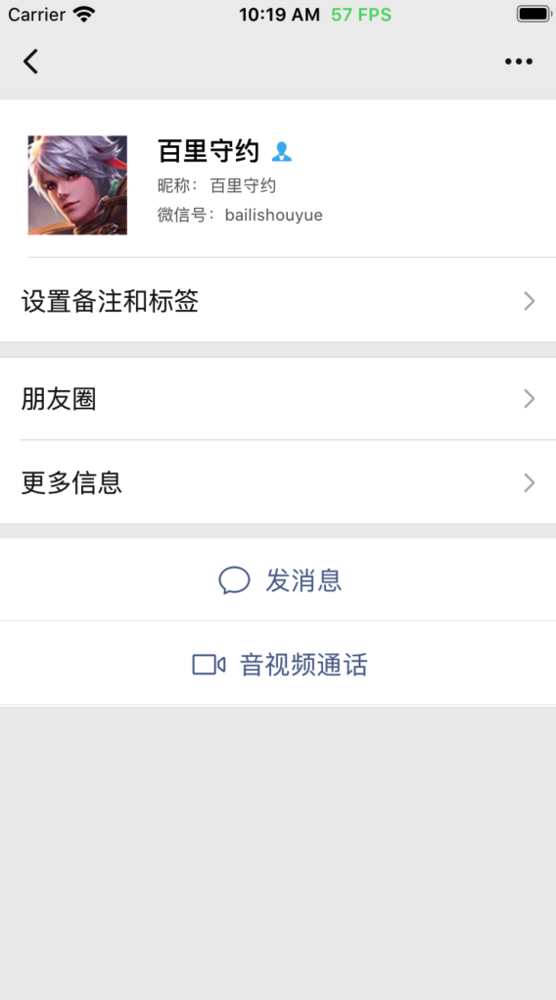

## iOS 微信开发


### 👏 更新

- 202010：增加 `我下拉视频动态` 模块。
- 202007：增加 `微信下拉小程序` 模块。
- 202006：增加 `微信/通讯录搜索` 模块。
- 202005：增加 `通讯录` 模块。

---

### 🚄 下载

- 若`pod install`很漫长或有问题，请戳百度网盘链接:链接:https://pan.baidu.com/s/1EoWYduzjS29Sqr5LiF6_Vg 密码:qmrr<PS：不定期更新！！！>

---

### ⭐️ 概述

- 本工程主要是利用`MVVM + RAC + ViewModel-Based Navigation`的方式来搭建微信（WeChat 7.0.0+）的整体架构，希望能够以点带面，为`MVVM + RAC + ViewModel-Based Navigation`的这种设计架构提供多一种的实践参考，也为大家在学习`MVVM`提供一个学习的 Demo。

- 本工程完全采用`Objective-C`语言编写，采用`Masonry` 和 `Xib`的两种控件布局方式；利用`cocoapods`管理第三方库，当然有些涉及到需要调整第三方库的 UI 时，采用的手动导入的方式；素材资源后期会慢慢和微信一样，完全采用`.svg`格式的图片资源来代替先前的`.png`资源，减少包体积。

- 笔者希望初学者通过学习和实践这个项目，能够打开学习`ReactiveCocoa`的大门。当然同时也是抛砖引玉，取长补短，希望能够提供一点思路，少走一些弯路，填补一些细坑，在帮助他人的过程中，收获分享技术的乐趣。

- 后期 UI 设计将完全参照最新的`微信(7.0.0+)`来开发，但是由于笔者时间有限，该项目的部分 UI，还是`微信(7.0.0-)`的 UI，大家切勿慌张，先请`Star`或`Fork`，谢谢。

- 大家若想回顾`微信(7.0.0-)`前的版本，还请拉取 `Tag：v1.0.0`分支的代码即可，笔者帮你们找找回忆，但希望大家尽量拉取`master`最新的代码，毕竟`往者不可谏，来者犹可追`。

- 本项目之前主要是用于团队内部交流使用，讲述利用`MVVM + RAC + ViewModel-Based Navigation`的方式来开发一款应用，介绍了其中使用技巧和实用技术，以及一些细节处理，实用为主，功能为辅。

- 由于`2019年初--至今`，笔者为求生计，被迫转学`Vue`开发，老将不死，只会逐渐凋零，以致于渐渐冷落了这个`Repo`(PS：**可能没 Star，没动力，哈哈....**)，后面会将微信的主要功能补全，尽最大努力还原真实微信。

### 🚀 模块

- ✅ 登陆/注册/登出 (ps: UI 尚未适配，逻辑正常)

- ✅ 我

  - ✅ 个人信息
  - ✅ 设置

- ✅ 发现

  - ✅ 朋友圈

- ✅ 通讯录

- ✅ 搜索

- 微信首页(TODO...)
  - ✅ 下拉小程序

---

### ❗️ 使用

- [Cocoapods 安装教程](https://www.cnblogs.com/chuancheng/p/8443677.html)

- 本`Demo`利用`Cocoapods`管理第三方框架，若第一次使用本项目，请使用终端`cd`到`Podfile`所在的文件夹中，如下图所示，然后执行下面两条命令即可，（PS：若你已经更新了本地仓库了，那么`pod repo update`不用执行，直接`pod install`即可）。

  

  ```
  1. pod repo update 或 pod repo update --verbose : 更新本地仓库
  2. pod install : 下载新的库
  ```

- 如果你升级了 Mac 的系统时，并且当你的 Mac 系统升级为`high sierra`的时候，别忘记更新`cocoapods`。执行命令为：

  ```
  $ sudo gem update --system
  $ sudo gem install cocoapods -n/usr/local/bin
  ```

- 本项目登录或注册，只支持`QQ账号`和`手机号`的登录或注册，必须保证`QQ`或`手机号`的有效性。密码或者验证码可以随便输入，但必须是：密码长度需要保证在`8~16`位，手机验证码必须保证是`6位有效数字`。

* 分支策略

  ```
  master: 各个功能完整，且稳定，出现Bug优先处理
  dev: 笔者的开发分支，意识流且不稳定，但知识或技术会超前 master 分支，还请按需加载。
  ```

---

### ♥️ 期待

- 如果在使用过程中遇到 BUG，希望你能 Issues 我，谢谢（或者尝试下载最新的代码看看 BUG 修复没有）。
- 如果在使用过程中有任何地方不理解，希望你能 Issues 我，我非常乐意促使项目的理解和使用，谢谢。
- 如果通过该工程的使用和说明文档的阅读，对您在开发中有一点帮助，码字不易，还请点击右上角`star`按钮，谢谢；
- 简书地址：<http://www.jianshu.com/u/126498da7523>

---

### ☎️ 主页

|                   GitHub                   |                            掘金                             |                        简书                        |                     CSDN                     | 知乎                                                 |
| :----------------------------------------: | :---------------------------------------------------------: | :------------------------------------------------: | :------------------------------------------: | ---------------------------------------------------- |
| [点击进入](https://github.com/CoderMikeHe) | [点击进入](https://juejin.im/user/59128ee21b69e6006868d639) | [点击进入](https://www.jianshu.com/u/126498da7523) | [点击进入](https://blog.csdn.net/u011581932) | [点击进入](https://www.zhihu.com/people/codermikehe) |

---

### 💰 拓展

- [iOS 开发技术要点汇总](https://github.com/CoderMikeHe/MHDevelopExample_Objective_C)
- [Flutter 版 WeChat](https://github.com/CoderMikeHe/flutter_wechat)
- [Vue 版 WeChat](https://github.com/CoderMikeHe/vue-wechat)
- [WeChat 资源汇总](https://github.com/CoderMikeHe/WeChat_Resource)

---

### 📖 文档

- [iOS 基于 MVVM + RAC + ViewModel-Based Navigation 的微信开发（一）](http://www.jianshu.com/p/fd407a4ecb8e)
- [iOS 基于 MVVM + RAC + ViewModel-Based Navigation 的微信开发（二）](http://www.jianshu.com/p/8c35fc02f47b)
- [iOS 基于 MVVM 设计模式的微信朋友圈开发](https://www.jianshu.com/p/2f161f6a310f)
- [iOS 实现微信朋友圈的最优方案参照](https://www.jianshu.com/p/395bac3648a7)
- [iOS 玩转微信——通讯录](https://www.jianshu.com/p/7c2d74675808)
- [iOS 玩转微信——下拉小程序](https://juejin.im/post/6856896741787205639)

---

### 🌈 预览

###### 🏳️‍🌈 微信模块

|  | 虚位以待 | 虚位以待 | 虚位以待 |
| :------------------------------------------------------------------------------------------------------------------: | :------: | :------: | :------: |


###### 🏳️‍🌈 通讯录模块

|  |  |  | 虚位以待 |
| :--------------------------------------------------------------------------------------------------------: | :--------------------------------------------------------------------------------------------------------: | :------: | :------: |


###### 🏳️‍🌈 搜索模块

|  |  |  |  |
| :----------------------------------------------------------------------------------------------------: | :----------------------------------------------------------------------------------------------------: | :----------------------------------------------------------------------------------------------------: | :----------------------------------------------------------------------------------------------------: |
|  |  |  |  |

###### 🏳️‍🌈 发现模块

|  | 虚位以待 | 虚位以待 | 虚位以待 |
| :--------------------------------------------------------------------------------------------------------: | :------: | :------: | :------: |


###### 🏳️‍🌈 朋友圈模块

|  |  | 虚位以待 | 虚位以待 |
| :------------------------------------------------------------------------------------------------------: | :------------------------------------------------------------------------------------------------------: | :------: | :------: |


###### 🏳️‍🌈 我模块

|  | 虚位以待 | 虚位以待 | 虚位以待 |
| :------------------------------------------------------------------------------------------------------: | :------: | :------: | :------: |

